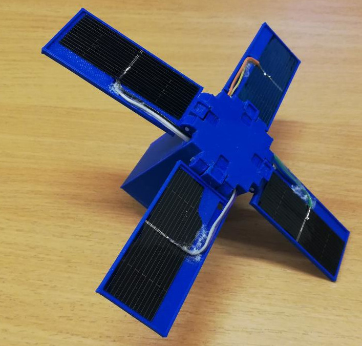
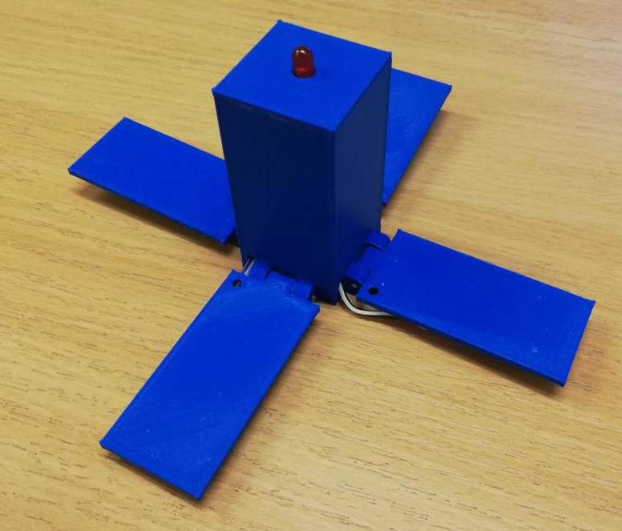
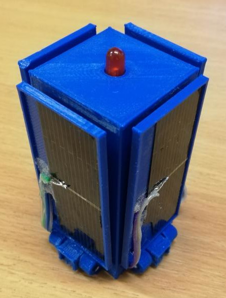
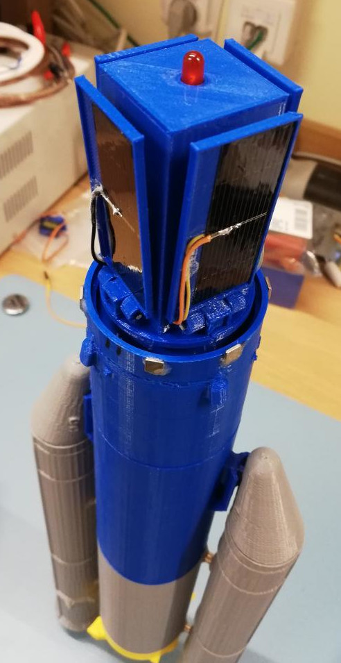

# toy satellite model

solar-powered toy for children.
when solar panels (PVs) are unfolded, it transmits a message configured in `main.cpp`, using [morse code](https://en.wikipedia.org/wiki/Morse_code).
currently the message is "hello humans of the planet earth". :)
message repeats as long as there is power.

PV panels are foldable.
it is possible to hold them in place with 5x5x1mm neodymium magnets.
in practice however friction-fit of a print is enough.

## rocket mount

model has been created to fit cargo bay of the [Ariane 5 model](https://github.com/el-bart/external_3d_prints/tree/master/Ariane_5).

## repo tour

repository consists of 3 main elements:
* `enc/` - 3D printable satellite enclosure (OpenSCAD).
* `sw/` - software for handling LED-blinking in morse code (C++).
* `hw/` - hardware schematic and PCB (KiCad).

all toolchains are dockerized and fully automated.
on linux machine with `docker` it is enough to type `make` in a root directory and all required things will get built for you. :)

## what's needed?

for enclosure you'll obviously need a 3D printer.
it is also possible the order the prints from a factory.
there are no special requirements or print settings
note that hinges for PVs are created using cut line segments of 1.75mm filament, rolled through PV and main body of satellite.

PCB is fairly simple.
you can either order it from your favorite PCB provider or do at home.
even though it's SMD, it deliberately uses large elements, with lots of spacing, to make hand-soldering simple.

in order to flash firmware to microcontroller you'll need a ISP programmer for ATtiny13.
[USBasp](https://www.fischl.de/usbasp/) programmer will do.
just make sure it [supports SCK to program AVR running with a slow clock](https://baszerr.eu/doku.php?id=blog:2022:08:09:2022-08-09_-_slowly_programming_slow_avrs).
note that for ATtiny13 you'll need a programming clamp, as there is no dedicated programming header.

PVs shall be glued to the surface of a PV mount with CA glue.
for the sake of usage it's highly recommended to paint the upper surface with transparent nail paint.
this will further protect panel from damages.
in case it shreds to pieces, it will also prevent small and sharp parts from landing all around the floor.

## version history

### dev
* cable slot on PV panel changed to fit actual cable route.

### v1.1
* PCB holes for PV soldering are now using standard goldpin pitch.
* added some basic documentation.

### v1.0
* fist version even build.
* LED blinking.
* morse code supporting full alphabet.
* fully-automated build (enclosure, software and gerber files for PCB manufacturing).
